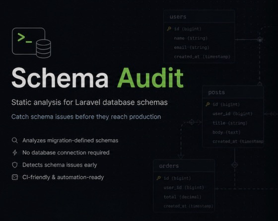
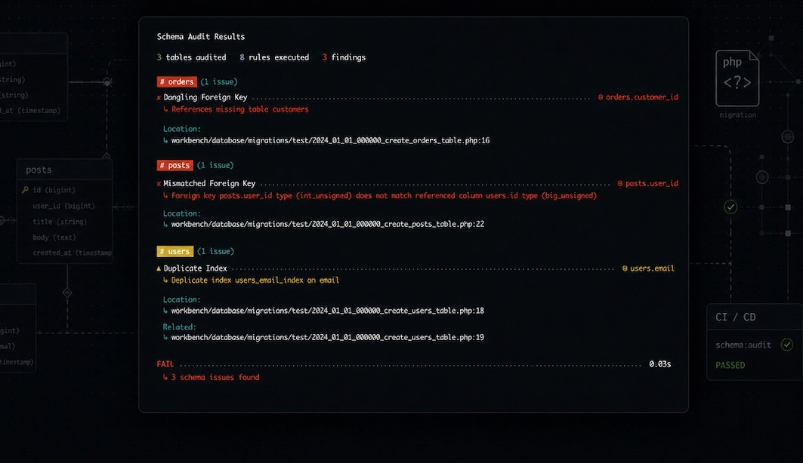

<p align="center">
    <kbd>
        
    </kbd>
</p>

<p></p>

<p align="center">
    <kbd>
        
    </kbd>
</p>

<p></p>

<p align="center">
    <a href="https://github.com/chr15k/laravel-schema-audit/actions"></a>
    <a href="https://packagist.org/packages/chr15k/laravel-schema-audit"></a>
    <a href="https://packagist.org/packages/chr15k/laravel-schema-audit"></a>
    <a href="https://packagist.org/packages/chr15k/laravel-schema-audit"></a>
</p>

------

# Laravel Schema Audit

**Catch schema problems before production**

Laravel Schema Audit statically reconstructs your database schema from its migration history and catches structural issues before they reach production.

No database connection. No migration execution. Just fast, CI-friendly analysis that detects duplicate and redundant indexes, invalid foreign keys, mismatched types, invalid references, missing primary keys, and more.

Built for Laravel and designed to work with real-world migration code, including common conventions and conditional schema logic.

---

## Requirements

- PHP 8.2+
- Laravel 10, 11, 12, or 13

---

## Installation

```bash
composer require chr15k/laravel-schema-audit --dev
```

Optionally publish the config file:

```bash
php artisan vendor:publish --tag=schema-audit-config
```

---

## Usage

```bash
php artisan schema:audit
```

By default this reads `database/migrations` and prints a styled report. The command exits with a non-zero status when findings are present, making it suitable for CI.

```bash
# scan a different migration directory
php artisan schema:audit --path=/path/to/migrations

# machine-readable output for CI and automation
php artisan schema:audit --json

# inspect the reconstructed schema without running rules
php artisan schema:audit --schema-only
```

> [!IMPORTANT]
> Schema Audit treats all provided migration paths as one database schema.
> Run separate audits for applications or connections with independent databases.

---

## What gets checked

| Rule | What it flags |
|---|---|
| `UnindexedForeignKeyRule` | A foreign key with no covering index. Driver-aware based on whether the target database automatically indexes foreign key columns. |
| `DuplicateIndexRule` | The same index (same columns, same uniqueness) declared more than once. |
| `DuplicateForeignKeyRule` | The same foreign key (same column, same referenced table) declared more than once. |
| `RedundantIndexRule` | A single-column index already covered by a composite index's leading column. |
| `DanglingForeignKeyRule` | A foreign key referencing a table that doesn't exist anywhere in the schema — a typo, or a table renamed/dropped without updating the reference. |
| `MismatchedForeignKeyRule` | A foreign key whose column type doesn't match the referenced table's primary key type (e.g. `foreignId()` pointing at a plain `increments()` primary key). |
| `MissingPrimaryKeyRule` | A table with no identifiable primary key — no `id()`/`increments()`-style column and no explicit `primary()` call. |
| `InvalidReferencedKeyRule` | A foreign key referencing a column with no primary or unique key on the parent table. |

> [!NOTE]
> Rules run against the schema reconstructed from your migration history. For ordinary migrations, findings are concrete. Where runtime conditionals affect schema changes, affected findings are marked conditional because the resulting schema cannot be determined statically with certainty.

---

## Enforce your own schema policies

Built-in rules catch common database problems. Custom rules let your team enforce **application-specific schema standards in CI**.

For example, you might want to prevent developers from adding expensive column types to high-traffic tables:

```php
final readonly class NoTextColumnsOnHighTrafficTablesRule extends Rule
{
    public function handle(AuditContext $context, Closure $next): AuditContext
    {
        $findings = [];

        foreach ($context->schema->tables() as $table) {
            if (! in_array($table->name, ['orders', 'events', 'sessions'], true)) {
                continue;
            }

            foreach ($table->columns() as $column) {
                if ($column->method === ColumnMethod::Text) {
                    $findings[] = $this->makeFinding(
                        table: $table->name,
                        columns: $column->name,
                        message: "Avoid TEXT columns on high-traffic tables.",
                        location: $column->location,
                        guard: $column->guard,
                    );
                }
            }
        }

        return $next($context->withFindings($findings));
    }
}
```

Register it alongside the built-in rules:

```php
'rules' => [
    Rules\UnindexedForeignKeyRule::class,
    Rules\DuplicateIndexRule::class,
    App\SchemaRules\NoTextColumnsOnHighTrafficTablesRule::class,
],
```

This turns Schema Audit into more than a collection of database checks: **your team can codify its own schema rules and make them part of the CI pipeline.**

See [`GUIDE.md`](GUIDE.md) for writing custom rules and advanced usage.

---

## Configuration

```php
// config/schema-audit.php
use Chr15k\SchemaAudit\Rules;

return [
    'paths' => [
        database_path('migrations'),
    ],
    'driver' => env('DB_CONNECTION', 'mysql'),
    'rules' => [
        Rules\UnindexedForeignKeyRule::class,
        Rules\DuplicateIndexRule::class,
        Rules\DuplicateForeignKeyRule::class,
        Rules\RedundantIndexRule::class,
        Rules\DanglingForeignKeyRule::class,
        Rules\MissingPrimaryKeyRule::class,
        Rules\MismatchedForeignKeyRule::class,
        Rules\InvalidReferencedKeyRule::class,
    ],
    'report_conditional_findings' => true,
];
```

> [!NOTE]
> `paths` — migration directories to analyze. Use `--path` to override for a single run.
>
> `driver` — target database driver. Some rules are driver-specific, such as whether foreign keys automatically create indexes.
>
> `report_conditional_findings` — report findings affected by conditional schema logic. Set to `false` to suppress them.
>
> `rules` — enable, disable, or replace audit rules.

---

## Documentation

See the [Guide](GUIDE.md) for:

- supported schema operations
- static value resolution
- conditional migrations
- limitations and unsupported operations
- multiple database connections
- writing custom rules

---

## Limitations

Schema Audit uses static analysis rather than executing migrations. It supports Laravel's Schema Builder and common Laravel conventions, but runtime-generated schema changes and database-specific SQL cannot always be reconstructed.

Conditional schema changes are handled conservatively and affected findings are marked **conditional**.

See the [Guide](GUIDE.md) for supported operations, conditional migrations, static value resolution, and unsupported cases.
