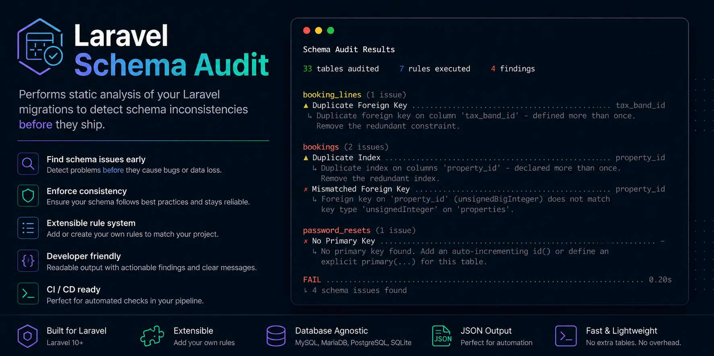

<picture>
    <source media="(prefers-color-scheme: dark)" srcset="art/header.webp">
    
</picture>

<p></p>

<p align="center">
    <a href="https://github.com/chr15k/laravel-schema-audit/actions"></a>
    <a href="https://packagist.org/packages/chr15k/laravel-schema-audit"></a>
    <a href="https://packagist.org/packages/chr15k/laravel-schema-audit"></a>
    <a href="https://packagist.org/packages/chr15k/laravel-schema-audit"></a>
</p>

------

# Laravel Schema Audit

Static analysis that audits your migration-declared schema — catching
unindexed foreign keys, duplicate/redundant indexes, dangling foreign
keys, type-mismatched foreign keys, and missing primary keys before they
ship.

No database connection required. No test traffic required. It folds
your migration history into final per-table schema state and checks it
for internal consistency.

## Why this over a runtime query monitor?

This package is not a replacement for runtime query monitoring — Laravel
Debugbar, Telescope, and laravel-query-detector already do a good job catching
N+1 query storms as they happen, using real execution data this package doesn't
have access to. What this package checks instead is schema-level consistency: facts
about your migrations that are true or false regardless of how the code queries them.

This package solves a different, narrower problem that runtime tools
structurally can't:

- **It doesn't need the code to run.** A rarely-hit admin report, a
  seasonal batch job, a conditional branch nobody's exercised in staging
  — none of that shows up in a query monitor until someone triggers it,
  possibly in production. Static analysis reads the migrations directly.
- **It runs in CI, before merge.** Point it at a pull request's migrations
  and it can flag a missing index or a dangling foreign key before the
  code ships.
- **It checks facts a query monitor was never built to check** — whether
  an index exists at all, whether two foreign keys' types actually
  match, whether an index is declared twice for no reason. These are
  schema-internal-consistency questions, not query-performance questions.

This package deliberately does **not** attempt N+1 detection, query
timing, or execution-plan analysis — see [Honest limitations](#honest-limitations).

## Installation

```bash
composer require chr15k/laravel-schema-audit --dev
```

Optionally publish the config file:

```bash
php artisan vendor:publish --tag=schema-audit-config
```

## Usage

```bash
php artisan schema:audit
```

By default this reads `database/migrations` and prints a styled report
of any findings, exiting non-zero if issues were found (CI-friendly).

```bash
# scan a different directory
php artisan schema:audit --path=/path/to/migrations

# machine-readable output
php artisan schema:audit --json

# print the raw folded schema instead of running rules — useful for
# debugging what the tool actually thinks your schema looks like
php artisan schema:audit --schema-only
```

## What this package checks

| Rule | What it flags |
|---|---|
| `UnindexedForeignKeyRule` | A foreign key column with no covering index. Driver-aware — MySQL/MariaDB auto-index FK columns, PostgreSQL/SQLite/SQL Server do not, so this only fires where it's actually true for your configured driver. |
| `DuplicateIndexRule` | The same index (same columns, same uniqueness) declared more than once. |
| `DuplicateForeignKeyRule` | The same foreign key (same column, same referenced table) declared more than once. |
| `RedundantSingleColumnIndexRule` | A single-column index already covered by a composite index's leading column. |
| `DanglingForeignKeyRule` | A foreign key referencing a table that doesn't exist anywhere in the folded schema — a typo, or a table renamed/dropped without updating the reference. |
| `MismatchedForeignKeyRule` | A foreign key whose column type doesn't match the type family of the referenced table's primary key (e.g. `foreignId()` pointing at a plain `increments()` primary key). |
| `NoPrimaryKeyRule` | A table with no identifiable primary key — no `id()`/`increments()`-style column and no explicit `primary()` call. |

Every rule is a pure fact about the folded schema — no query usage, no
runtime data, no heuristics about "is this a good index." If a rule
fires, it's because something in your migration history is verifiably
inconsistent, not because a pattern looked suspicious.

## Configuration

```php
// config/schema-audit.php
return [
    'path' => 'database/migrations',
    'driver' => env('DB_CONNECTION', 'mysql'),
    'rules' => [
        \Chr15k\SchemaAudit\Rules\UnindexedForeignKeyRule::class,
        \Chr15k\SchemaAudit\Rules\DuplicateIndexRule::class,
        \Chr15k\SchemaAudit\Rules\DuplicateForeignKeyRule::class,
        \Chr15k\SchemaAudit\Rules\RedundantSingleColumnIndexRule::class,
        \Chr15k\SchemaAudit\Rules\DanglingForeignKeyRule::class,
        \Chr15k\SchemaAudit\Rules\MismatchedForeignKeyRule::class,
        \Chr15k\SchemaAudit\Rules\NoPrimaryKeyRule::class,
    ],
];
```

- **`path`** — default migrations directory; `--path` overrides it per run.
- **`driver`** — defaults to your app's configured connection
  (`DB_CONNECTION`); override with `--driver` to audit against a
  different target database than the one currently configured.
- **`rules`** — remove an entry to disable that rule without touching
  any package code. Add your own class here too — see below.

## Writing custom rules

Any class implementing `Chr15k\SchemaAudit\Contracts\Rule` can be added
to `config('schema-audit.rules')` alongside the built-in ones:

```php
namespace App\SchemaRules;

use Chr15k\SchemaAudit\Contracts\Rule;
use Chr15k\SchemaAudit\ValueObjects\Finding;

final class NoTextColumnsOnHighTrafficTablesRule implements Rule
{
    public function check(array $tables): array
    {
        $findings = [];

        foreach ($tables as $table) {
            foreach ($table->columns() as $column => $type) {
                if ($type === 'text' /* ...your condition... */) {
                    $findings[] = new Finding(
                        rule: 'no_text_on_high_traffic_tables',
                        table: $table->name,
                        column: $column,
                        message: "Column '{$column}' is a text column on a high-traffic table.",
                    );
                }
            }
        }

        return $findings;
    }
}
```

`$tables` is `array<string, TableSchema>` — the fully folded schema.
Useful `TableSchema` methods: `columns()`, `indexes()`, `foreignKeys()`,
`isIndexed()`, `hasPrimaryKey()`, `primaryKeyColumnType()`.

## Requirements

- PHP 8.2+
- Laravel 10, 11, 12, or 13

## Honest limitations

- **Works entirely from source** — it does not run your migrations or
  connect to a database. A manual `ALTER TABLE`, a seeder-driven schema
  change, or anything done outside a migration won't be seen.
- **Composite (multi-column) foreign keys are not currently parsed.**
  `$table->foreign(['a', 'b'])->references(['x', 'y'])->on(...)` is
  silently skipped by all foreign-key rules. Single-column foreign keys
  — including `foreignId()`, by far the more common case — are fully
  supported, as are composite **indexes** (`$table->index(['a', 'b'])`),
  which are a separate, already-working feature.
- **Conditional migration logic is read as written.** `if
  (DB::getDriverName() === 'mysql') { ... }` in a migration is parsed
  literally — the tool can't resolve which branch is "true" for your
  environment.
- **Not a replacement for `EXPLAIN`, query profiling, or a DBA review.**
  It catches a specific, narrow class of static schema mismatch —
  nothing about query performance or data-dependent behavior.
- **No N+1 or query-usage detection**, by design — see
  [Why this over a runtime query monitor?](#why-this-over-a-runtime-query-monitor).
